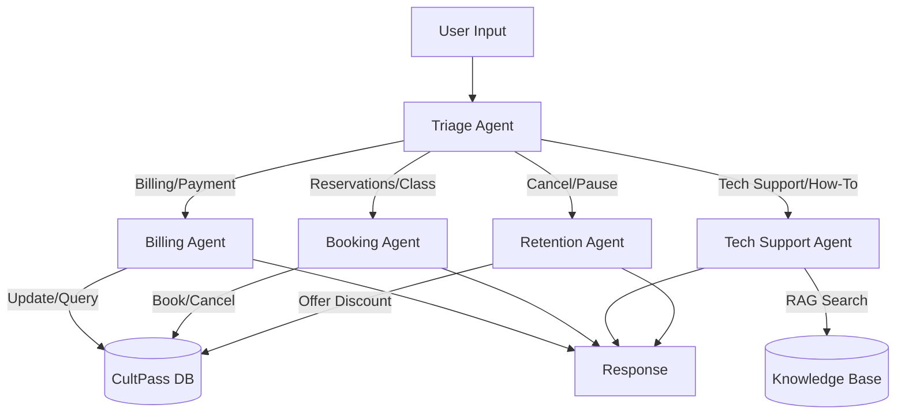

# CultPass Multi-Agent Support System

## Overview
This system utilizes a multi-agent architecture powered by LangGraph to handle customer support tickets for the CultPass application. It routes tickets to specialized agents based on user intent and maintains conversation state across interactions.

## Architecture

### System Diagram

### Roles and Responsibilities

| Agent | Responsibility | Tools |
| :--- | :--- | :--- |
| **Triage Agent** | Analyzes the initial user message to determine intent and routes to the appropriate specialist. | None (LLM Router) |
| **Billing Agent** | Handles subscription inquiries, upgrades, payment method updates, and quota checks. | `lookup_user`, `get_subscription_status`, `update_subscription` |
| **Booking Agent** | Manages event reservations, checking availability, and cancellations. | `get_user_reservations`, `book_reservation`, `cancel_reservation` |
| **Tech Support Agent** | Answers general how-to questions, troubleshooting, and app issues using the Knowledge Base. Escalates if no answer found. | `search_knowledge_base` |
| **Retention Agent** | Specializes in handling requests to cancel or pause subscriptions by offering alternatives or verifying policy. | `get_retention_policy` |

## State Management
The system uses `LangGraph`'s `SqliteSaver` to persist state (messages) between turns.
- **Thread ID**: Every conversation is tracked by a unique `thread_id`.
- **Short-term Memory**: The graph state passes the list of `messages` between nodes, giving agents context of the immediate conversation.
- **Long-term Memory**: User and subscription data is stored in the persistent `CultPass DB`. Interaction logs are stored in `TicketMessage` and `AgentLog` tables for audit and context.